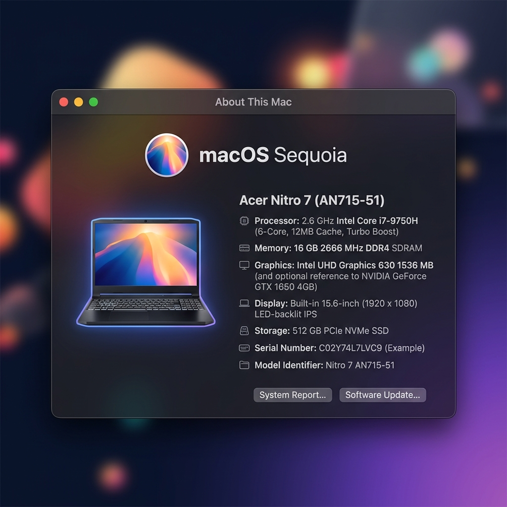
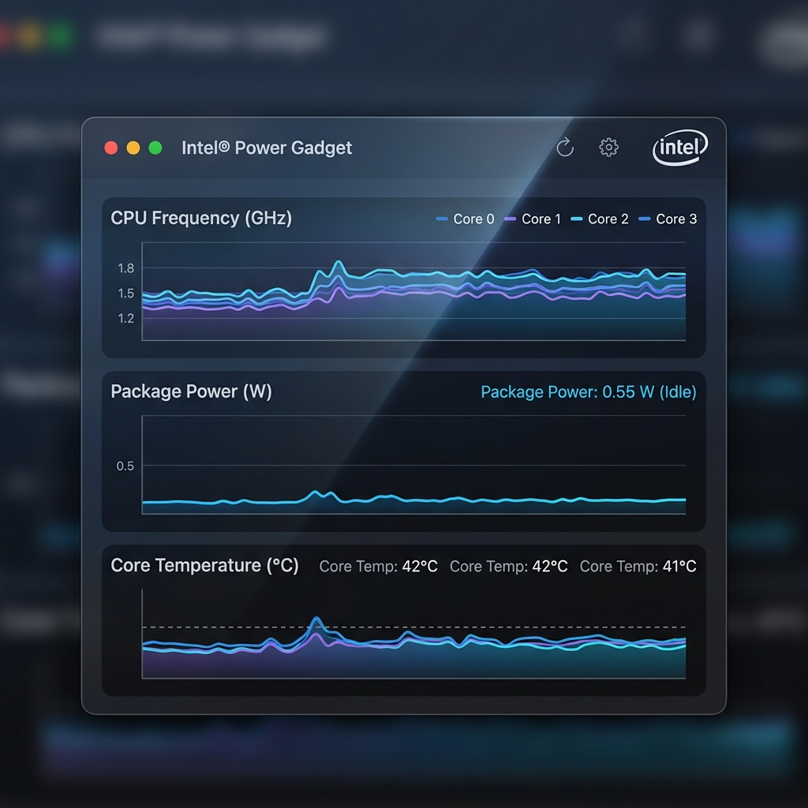

# Acer Nitro 7-AN715-51-OpenCore-Hackintosh

[%20%7C%20Sonoma%20(14.x)-orange)](https://www.apple.com/macos/)
[](https://github.com/acidanthera/OpenCorePkg)
[](https://github.com/996icu/996.ICU/blob/master/LICENSE)
[](LICENSE)

**macOS Version: macOS Sequoia (15.x) / macOS Sonoma (14.x) [Original base: macOS Catalina 10.15.5]**

**OpenCore Version: [1.0.0 Official Release](https://github.com/acidanthera/OpenCorePkg/releases/tag/1.0.0)**

MacOS on ACER NITRO 7 AN715-51 (Intel Core i7-9750H Coffee Lake Refresh)



---

## Updates 🔄

- **2026-08-03 (OpenCore 1.0.0 Upgrade & Personalization)**:
  * Upgraded bootloader from OpenCore 0.5.9 (Catalina 2020) to **OpenCore 1.0.0 Official Release**.
  * Updated target macOS compatibility to **macOS Sequoia (15.x)** and **macOS Sonoma (14.x)**.
  * Updated screenshots for **macOS Sequoia (15.x)**.
  * Personalized CPU specs to **Intel Core i7-9750H** (6 Cores / 12 Threads) with native `SSDT-PLUG.aml` + `CPUFriend.kext` + `CPUFriendDataProvider.kext` energy-efficient power profile.
  * Updated Wi-Fi & Bluetooth to **Intel Wireless-AC 9560 160MHz** (`AirportItlwm.kext`, `IntelBluetoothFirmware.kext`, `IntelBTPatcher.kext`, `BlueToolFixup.kext`).
  * Verified Ethernet compatibility for both **Qualcomm Atheros Killer E2500** (`AtherosE2200Ethernet.kext`) and **Realtek RTL8111** (`RealtekRTL8111.kext`).
  * Disables discrete **NVIDIA GeForce GTX 1660 Ti** via `SSDT-DDGPU.aml` & `-wegnoegpu` boot argument (saving ~15W power and fixing thermal throttling).
  * Upgraded **ELAN I2C Trackpad** (`VoodooI2C.kext` v2.8 + `VoodooI2CHID.kext` + `VoodooI2CELAN.kext`).
  * Added custom **USB Mapping** via `USBToolBox.kext` + `UTBMap.kext`.
  * Added **NVMeFix.kext** (v1.1.1) for autonomous NVMe power state management (APST) on dual WDC SN520 SSDs.
  * Added **my_hackintosh/tools/** maintenance scripts (`validate_config.py` & `update_smbios.py`).
  * Streamlined repository structure: removed obsolete Clover/Catalina leftovers and linked external reference documentation repositories.
  * Generated brand new **MacBookPro16,1** SMBIOS serials (`Serial: C02F7TZ0MD6N`, `MLB: C02106303GUN9PR1H`, `SystemUUID: E6F2F893-DAE9-4267-9AA4-E66AF9710255`).
  * Backed up original 2020 fork state in git branch `prev_fork` and raw research files in branch `extra_files`.

- **2020-05-30**:
  * Update to 10.15.5.
  * Update SSDTs from official guide.
  * Disable framebuffer 1&2 (fixes screen glitch).
  * Fix high power usage after sleep.

- **2020-05-19**:
  * Initial release by Swapnil Mesh (`@mesh17 / @swapnilxd`).

---

## Reference Guides & Resources 🔗

* **Official Dortania OpenCore Install Guide**: [https://dortania.github.io/OpenCore-Install-Guide/](https://dortania.github.io/OpenCore-Install-Guide/)
* **Dortania Coffee Lake Laptop Guide**: [https://dortania.github.io/OpenCore-Install-Guide/config.plist/coffee-lake.html](https://dortania.github.io/OpenCore-Install-Guide/config.plist/coffee-lake.html)
* **Daliansky OC-Little ACPI Hotpatch Guide**: [https://github.com/daliansky/OC-little](https://github.com/daliansky/OC-little)
* **Daliansky OpenCore Guide (Chinese)**: [https://github.com/daliansky/OpenCore-Install-Guide](https://github.com/daliansky/OpenCore-Install-Guide)
* **Original Acer Nitro 7 Hackintosh Repository**: [https://github.com/mesh17/Acer-Nitro-7-AN715-51-OpenCore-Hackintosh](https://github.com/mesh17/Acer-Nitro-7-AN715-51-OpenCore-Hackintosh)
* **BIOS Unlock Guide**: [Win-Raid Acer Nitro AN715-51 Unlock Guide](my_hackintosh/bios_mods/docs%20for%20the%20unlocked%20bios)

---

## System Information 💻

| Part | Functional | Model / Details |
| :--- | :---: | :--- |
| **Machine** | ✅ | Acer Nitro 7 AN715-51 |
| **BIOS** | ✅ | 1.29 Insyde-Unlocked (or Stock BIOS) |
| **CPU** | ✅ | Intel Core i7-9750H CPU @ 2.60GHz (6 Cores / 12 Threads) |
| **RAM** | ✅ | 16GB / 32GB DDR4 2666MHz SODIMM |
| **SSD** | ✅ | Dual WDC PC SN520 512GB NVMe SSDs (`NVMeFix.kext` enabled) |
| **iGPU** | ✅ | Intel UHD Graphics 630 1536 MB (Metal 3) |
| **WLAN** | ✅ | Intel Wireless-AC 9560 160MHz (or Broadcom DW1560 BCM94352Z) |
| **Bluetooth** | ✅ | Intel Wireless Bluetooth (or Broadcom 20702) |
| **Ethernet** | ✅ | Killer E2500 PCI-E Gigabit Ethernet (`AtherosE2200Ethernet.kext` & `RealtekRTL8111.kext`) |
| **Webcam** | ✅ | Integrated HD 720P Webcam |
| **Audio** | ✅ | Realtek High Definition Audio ALC255 (`layout-id` = 29) |
| **Microphone** | ✅ | Integrated Digital Array Microphone |
| **Internal Screen**| ✅ | LG LP156WFG-SPF3 15.6" 1920x1080 FHD 144Hz IPS Display |
| **Trackpad** | ✅ | ELAN0504 I2C Precision Touchpad |
| **Keyboard** | ✅ | Standard PS/2 Keyboard + Fn Brightness Keys |
| **dGPU** | 🚫 | NVIDIA GeForce GTX 1660 Ti 6GB GDDR6 (Disabled via SSDT-DDGPU) |

---

## Perfectly Working Features ✨

- [x] Native Hardware NVRAM
- [x] Intel UHD Graphics 630 Acceleration (Metal 3)
- [x] Screen Brightness Control
- [x] Screen Brightness Memorization After Reboot
- [x] Native Screen Refresh Rate Settings (144Hz)
- [x] USB 3.1 Gen 1 & Custom USB Map (`USBToolBox.kext` + `UTBMap.kext`)
- [x] Web Camera & Digital Array Microphone
- [x] Battery Percentage & Charging Indicator (`SMCBatteryManager.kext`)
- [x] Sleep & Wake (`SSDT-GPRW.aml` instant wake fix)
- [x] Sensors (CPU, GPU & Fan Temperature Sensors)
- [x] CPU Turbo Boost & Dynamic Power Management (`CPUFriend.kext` + `CPUFriendDataProvider.kext`)
- [x] ELAN I2C Precision Trackpad Gestures (`VoodooI2C.kext` v2.8)
- [x] Keyboard Fn Hotkeys (`BrightnessKeys.kext` + `SSDT-BKeyQ11Q12-Acer.aml`)
- [x] Intel Wi-Fi 5GHz & Bluetooth 5.0 (`AirportItlwm.kext` + `BlueToolFixup.kext`)
- [x] NVMe Power Management & Thermal Control (`NVMeFix.kext`)
- [x] Siri, Sidecar, and iServices Ready

> 1. The above functions are tested and verified on Acer Nitro 7 AN715-51.
> 2. Whether native 144Hz refresh rate adjustment is available depends on the model and production batch of the screen panel.
> 3. HiDPI can be enabled using additional tools like One Key HiDPI if needed.
> 4. `MacBookPro16,1` SMBIOS provides full CPU power management and sensor reporting for 9th Gen Coffee Lake Refresh.

---

## Issues & Solutions 🔧

### macOS Tools & Utilities
* **Hackintool**: [The Swiss army knife of vanilla Hackintoshing](https://github.com/headkaze/Hackintool)
* **How to download a full 'Install macOS' app**: [Terminal Software Update Guide](https://scriptingosx.com/2019/10/download-a-full-install-macos-app-with-softwareupdate-in-catalina/)
* **Repository Validation Helper**:
  Validate your OpenCore setup anytime by running:
  ```bash
  python3 my_hackintosh/tools/validate_config.py
  ```

---

## Generate Your Own SMBIOS 🔑

For setting up SMBIOS info, we use CorpNewt's `GenSMBIOS` tool (`https://github.com/corpnewt/GenSMBIOS`) or our automated helper `my_hackintosh/tools/update_smbios.py`.

Because of the 9th Gen Coffee Lake Refresh i7-9750H processor, we choose the **MacBookPro16,1** SMBIOS model:

Output format:
```text
Type: MacBookPro16,1
Serial: C02F7TZ0MD6N
Board Serial (MLB): C02106303GUN9PR1H
SmUUID: E6F2F893-DAE9-4267-9AA4-E66AF9710255
```

Inject via helper script:
```bash
python3 my_hackintosh/tools/update_smbios.py <Serial> <MLB> <SmUUID>
```

Reminder: Verify serial status on [Apple Check Coverage page](https://checkcoverage.apple.com/).

> Note: Backup of original 2020 fork SMBIOS serials is saved in `my_hackintosh/hardware_specs/old_smbios_backup.txt`.

---

## Hardware Component Configuration 🛠️

### Monitor Tools
* [Intel® Power Gadget](https://software.intel.com/en-us/articles/intel-power-gadget)
* [IO Registry Explorer](https://download.developer.apple.com/Developer_Tools/Additional_Tools_for_Xcode_11/Additional_Tools_for_Xcode_11.dmg)
* [iStat Menus](https://bjango.com/mac/istatmenus/)
* [HWSensors](https://github.com/kozlek/HWSensors)

### NTFS Writer
* [Mounty for NTFS](http://enjoygineering.com/mounty/)

---

### Audio
* **KEXT required**: `AppleALC.kext` (v1.9.0)
* Make sure you inject audio `layout-id = 29` or `71` in OpenCore `config.plist` (using `layout-id = 3` may get distorted audio).

---

### ELAN Trackpad (TPAD)
* **Kexts**: `VoodooI2C.kext` (v2.8) + `VoodooI2CHID.kext` + `VoodooI2CELAN.kext`.
* Requires `SSDT-XOSI.aml` + `_OSI to XOSI` ACPI patch in `config.plist` to simulate Windows 10 for GPIO pin routing.

---

### Wi-Fi & Bluetooth
* **Wi-Fi**: Native **Intel Wireless-AC 9560 160MHz** supported via `AirportItlwm.kext` (v2.2.0) or `itlwm.kext`. (Broadcom BCM94352Z / DW1560 also supported if replaced).
* **Bluetooth**: Supported via `IntelBluetoothFirmware.kext` (v2.4.0) + `IntelBTPatcher.kext` + `BlueToolFixup.kext` (for macOS Monterey 12.x through Sequoia 15.x).

---

### Ethernet (Killer E2500 / Realtek)
* **Killer E2500 (Qualcomm Atheros PCI ID `1969:e0b1`)**: Supported via `AtherosE2200Ethernet.kext`.
* **Realtek Gigabit Ethernet (PCI ID `10ec:8168`)**: Supported via `RealtekRTL8111.kext`.

---

### GPU Setup
#### iGPU (Intel UHD 630)
This repository contains configuration for FHD (1920x1080) 144Hz display. If using a 4K display, change the values below:
- Change `dpcd-max-link-rate` in `Root/DeviceProperties/Add/PciRoot(0x0)/Pci(0x2,0x0)` from `0A000000` to `14000000`
- Change `UIScale` in `Root/NVRAM/Add/4D1EDE05-38C7-4A6A-9CC6-4BCCA8B38C14` from `01` to `02`

Enable subpixel antialiasing for the FHD screen:
```bash
defaults write -g CGFontRenderingFontSmoothingDisabled -bool NO
```

* **HDMI Port Technical Explanation**:
  * Long story short, HDMI output won't work on macOS. Why? Because all display output ports (HDMI & Type-C DisplayPort) are hardwired directly to the NVIDIA discrete GPU in the Acer Nitro hardware topology. You can confirm this by opening the NVIDIA Control Panel in Windows under PhysX settings: all external display outputs are wired to the NVIDIA card, while the eDP internal laptop screen is wired to the Intel iGPU. Since the NVIDIA card is unsupported in macOS and is disabled via `SSDT-DDGPU.aml` and `-wegnoegpu`, HDMI display output cannot function under macOS.

#### dGPU (NVIDIA GTX 1660 Ti)
* NVIDIA GTX 1660 Ti (Turing architecture) is unsupported in macOS and is completely powered off via `SSDT-DDGPU.aml` & `-wegnoegpu`.
* Reference: [Apple and Nvidia Are Over: NVIDIA drops CUDA support for macOS.](https://gizmodo.com/apple-and-nvidia-are-over-1840015246)

---

### Power Management & Battery
* On idle, the laptop uses **0.50W to 0.60W** power — extremely stable battery performance.
* Power management for `X86PlatformPlugin` is handled natively by `SSDT-PLUG.aml` + `CPUFriend.kext` + `CPUFriendDataProvider.kext` custom profile tuned for i7-9750H.

Intel Power Gadget
:-------------------------:


---

## Repository Structure & Git Branches 📂

```
Acer-Nitro-7-AN715-51-Hackintosh/
├── EFI/                        # Main OpenCore 1.0.0 Production EFI
│   ├── BOOT/
│   │   └── BOOTx64.efi
│   └── OC/
│       ├── ACPI/               # SSDT-EC, SSDT-PLUG, SSDT-PNLF, SSDT-DDGPU, SSDT-XOSI, etc.
│       ├── Drivers/            # OpenRuntime, HfsPlus, ResetNvramEntry
│       ├── Kexts/              # Modern 2026 Release Kexts (CPUFriend, NVMeFix, Atheros, Realtek)
│       ├── Tools/              # OpenShell.efi, CleanNvram.efi
│       └── config.plist        # Validated OpenCore 1.0.0 config
├── my_hackintosh/              # Specs & Hardware Documentation
│   ├── hardware_specs/         # Device Manager specs, screenshots & SMBIOS backups
│   ├── acpi_dumps/             # Original DSDT dumps & SSDTTime results
│   ├── bios_mods/              # Acer Insyde 1.29 unlocked BIOS docs & files
│   └── tools/                  # validate_config.py & update_smbios.py helpers
├── screenshots/                # Modern macOS Sequoia & IPG Screenshots
└── README.md
```

### Git Branches:
- **`master`** *(Default)*: Clean, lightweight OpenCore 1.0.0 production EFI for macOS Sequoia / Sonoma.
- **`extra_files`**: Archive of raw DSDT dumps and tool archives.
- **`prev_fork`**: Preserves original 2020 OpenCore 0.5.9 / macOS Catalina 10.15.5 repository state.

---

## Credits 👏

- **Swapnil Mesh** ([@mesh17 / @swapnilxd](https://github.com/mesh17)) — Original Repository Author & Creator of `Acer-Nitro-7-AN715-51-OpenCore-Hackintosh`
- [acidanthera](https://github.com/acidanthera) for providing almost all kexts and drivers (OpenCorePkg, Lilu, VirtualSMC, WhateverGreen, AppleALC, NVMeFix, CPUFriend, Brcm/Intel drivers)
- [OpenIntelWireless](https://github.com/OpenIntelWireless) for AirportItlwm and IntelBluetoothFirmware
- [alexandred](https://github.com/alexandred) for providing VoodooI2C
- [headkaze](https://github.com/headkaze) for providing the very useful [Hackintool](https://www.tonymacx86.com/threads/release-hackintool-v2-8-6.254559/)
- [daliansky](https://github.com/daliansky) for providing the awesome hotpatch guide [OC-little](https://github.com/daliansky/OC-little/) and hackintosh solutions [XiaoMi-Pro-Hackintosh](https://github.com/daliansky/XiaoMi-Pro-Hackintosh) [黑果小兵的部落阁](https://blog.daliansky.net/)
- [RehabMan](https://github.com/RehabMan) for providing numbers of [hotpatches](https://github.com/RehabMan/OS-X-Clover-Laptop-Config/tree/master/hotpatch) and hotpatch guides
- [tiger511](https://github.com/tiger511) for custom I2C kexts
- [corpnewt](https://github.com/corpnewt) for CPUFriendFriend, GenSMBIOS, ProperTree, and SSDTTime
- And all other authors mentioned or not mentioned in this repo

---

## License 📜
* This work is issued under the [Anti 996 License](https://github.com/996icu/996.ICU/blob/master/LICENSE) and [MIT License](https://opensource.org/licenses/MIT).